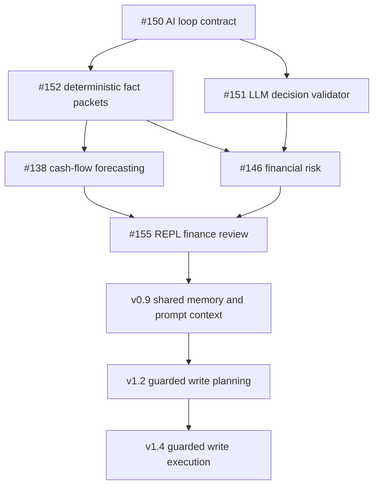

# Njord AI Capability Loop Roadmap

Njord uses AI-backed loops only after deterministic finance facts are built.
The LLM may interpret ambiguity, rank options, explain tradeoffs, and summarize
system health. It must not calculate balances, invent transactions, override
protected rules, approve cash-floor violations, or change state without user
approval.

## Execution Envelope

1. Detect trigger.
2. Read state.
3. Run deterministic services.
4. Generate structured facts.
5. Ask LLM for judgment only.
6. Validate LLM output against rules.
7. Produce recommendation.
8. Log decision.
9. Update state only after approval.

## v0.8 Foundation

v0.8 is interaction-first. It adds the finance review surface in the REPL and
establishes the reusable loop contracts needed before guarded planning.

Foundation issues:

- #150 defines the capability loop contract and execution envelope.
- #151 validates LLM decision output before it can be used.
- #152 defines deterministic fact packets for finance prompts.
- #138 adds cash-flow forecasting as a calculate-only loop.
- #146 adds financial risk as a score-and-explain loop.
- #154 gates later milestones on these contracts.
- #155 exposes the finance review in the REPL.

## Dependency Map

## Sequencing Gates

- Read-only loops may ship after fact packets and validation exist.
- Guarded planning must wait for validated facts, prompt context, and audit
  memory.
- Write execution must wait for explicit approvals, reconciliation, and audit
  replay.
- UI and auto-approval must wait for shared memory and enough reviewed decision
  history.

## Duplicate Overlap

Cash-flow forecasting and financial risk share source data, but they are
separate loops:

- Cash flow calculates future cash pressure.
- Financial risk scores fragility and mitigation priority.

The finance review composes both loops, so future budget planning can consume a
single interaction output without merging their responsibilities.

